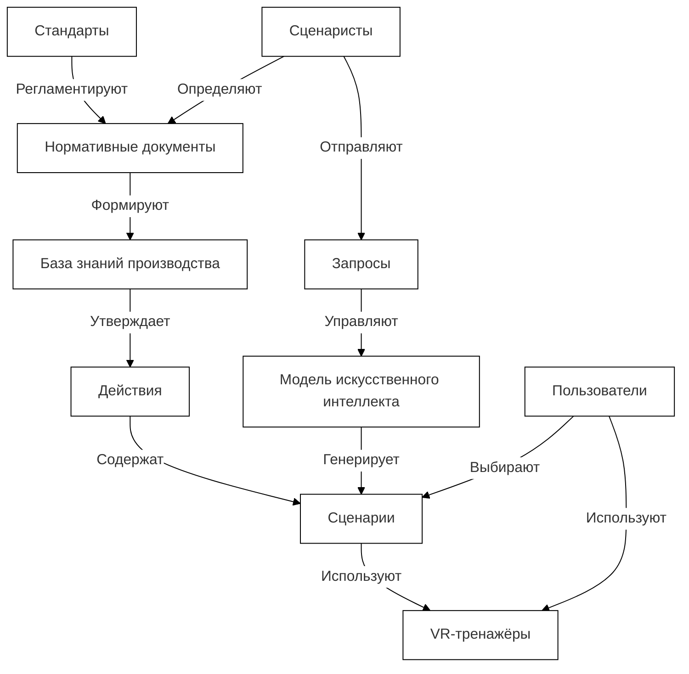

# 2. Контекстная диаграмма классов
#TODO

```mermaid
%%{init: {
  'theme': 'base',
  'themeVariables': {
    'primaryColor': '#fff',
    'primaryBorderColor': '#000',
    'lineColor': '#000',
    'fontSize': '16px'
  }
}}%%
graph TD
    %% Узлы
    ST[Стандарты]
    SC[Сценаристы]
    ND[Нормативные документы]
    ZR[Запросы]
    BZ[База знаний производства]
    AI[Модель искусственного интеллекта]
    DE[Действия]
    SN[Сценарии]
    PL[Пользователи]
    VR[VR-тренажёры]

    %% Связи с подписями
    ST -- "Регламентируют" --> ND
    SC -- "Определяют" --> ND
    SC -- "Отправляют" --> ZR
    ND -- "Формируют" --> BZ
    ZR -- "Управляют" --> AI
    BZ -- "Утверждает" --> DE
    AI -- "Генерирует" --> SN
    DE -- "Содержат" --> SN
    PL -- "Выбирают" --> SN
    PL -- "Используют" --> VR
    SN -- "Используют" --> VR

    %% Стилизация для прямоугольников
    style ST fill:#fff,stroke:#000
    style SC fill:#fff,stroke:#000
    style ND fill:#fff,stroke:#000
    style ZR fill:#fff,stroke:#000
    style BZ fill:#fff,stroke:#000
    style AI fill:#fff,stroke:#000
    style DE fill:#fff,stroke:#000
    style SN fill:#fff,stroke:#000
    style PL fill:#fff,stroke:#000
    style VR fill:#fff,stroke:#000
```
