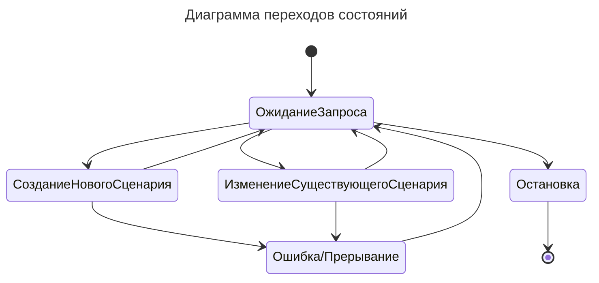

# Диаграмма переходов состояний

```mermaid
---
title: Диаграмма переходов состояний
---
stateDiagram-v2
    [*] --> ОжиданиеЗапроса

    ОжиданиеЗапроса --> СозданиеНовогоСценария
    ОжиданиеЗапроса --> ИзменениеСуществующегоСценария

    СозданиеНовогоСценария --> ОжиданиеЗапроса
    СозданиеНовогоСценария --> Ошибка/Прерывание
    ИзменениеСуществующегоСценария --> ОжиданиеЗапроса
    ИзменениеСуществующегоСценария --> Ошибка/Прерывание
    Ошибка/Прерывание --> ОжиданиеЗапроса
    ОжиданиеЗапроса --> Остановка
    Остановка --> [*]
```
