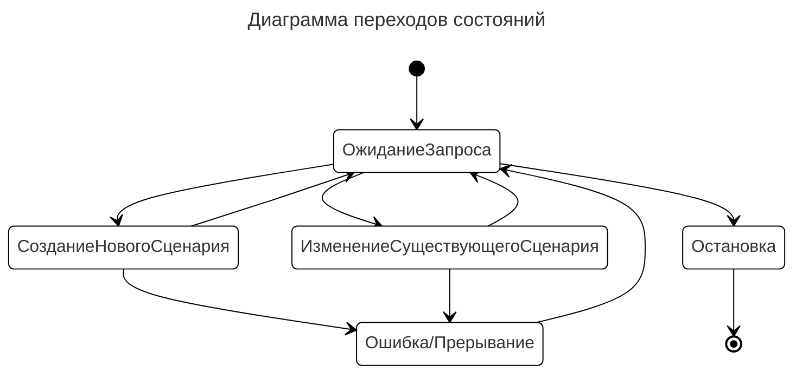

# Диаграмма переходов состояний

```mermaid
---
title: Диаграмма переходов состояний
---
%%{init: {
  'theme': 'base',
  'themeVariables': {
    'primaryColor': '#fff',
    'primaryBorderColor': '#000',
    'lineColor': '#000',
    'fontFamily': 'arial',
    'fontSize': '16px',
    'signalTextColor': '#000',
    'activationBackgroundColor': '#000'
  }
}}%%
stateDiagram-v2
    [*] --> ОжиданиеЗапроса

    ОжиданиеЗапроса --> СозданиеНовогоСценария
    ОжиданиеЗапроса --> ИзменениеСуществующегоСценария

    СозданиеНовогоСценария --> ОжиданиеЗапроса
    СозданиеНовогоСценария --> Ошибка/Прерывание
    ИзменениеСуществующегоСценария --> ОжиданиеЗапроса
    ИзменениеСуществующегоСценария --> Ошибка/Прерывание
    Ошибка/Прерывание --> ОжиданиеЗапроса
    ОжиданиеЗапроса --> Остановка
    Остановка --> [*]
```
