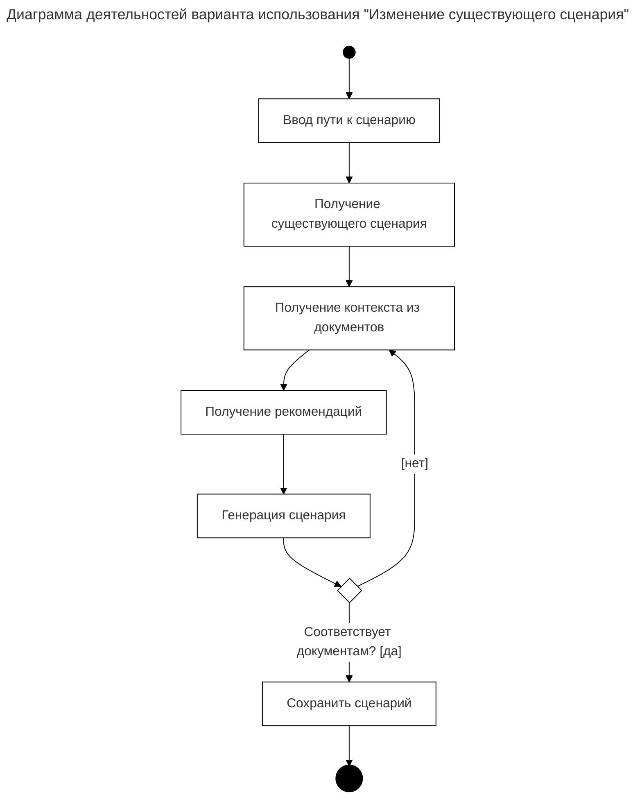

# Диаграмма деятельностей варианта использования

```mermaid
---
title: Диаграмма деятельностей варианта использования "Изменение существующего сценария"
---
%%{init: {
  'theme': 'base',
  'themeVariables': {
    'primaryColor': '#fff',
    'primaryBorderColor': '#000',
    'lineColor': '#000',
    'fontFamily': 'arial',
    'fontSize': '16px'
  }
}}%%
graph TD
    %% Элементы диаграммы
    StartNode(( ))

    A[Ввод пути к сценарию]
    Edit1[Получение существующего сценария]
    Edit2[Получение контекста из документов]
    Edit3[Получение рекомендаций]
    Edit4[Генерация сценария]

    CondSave{ }
    Save[Сохранить сценарий]
    EndNode((( )))

    %% Связи и ветвления
    StartNode --> A
    A --> Edit1
    Edit1 --> Edit2
    Edit2 --> Edit3
    Edit3 --> Edit4
    Edit4 --> CondSave

    %% Логика сохранения (Условие extend)
    CondSave -- "Соответствует документам? [да]" --> Save
    CondSave -- "[нет]" --> Edit2

    Save --> EndNode

    %% Стили для начальной и конечной точек
    style StartNode fill:#000,stroke:#000
    style EndNode fill:#000,stroke:#000,stroke-width:4px

```
