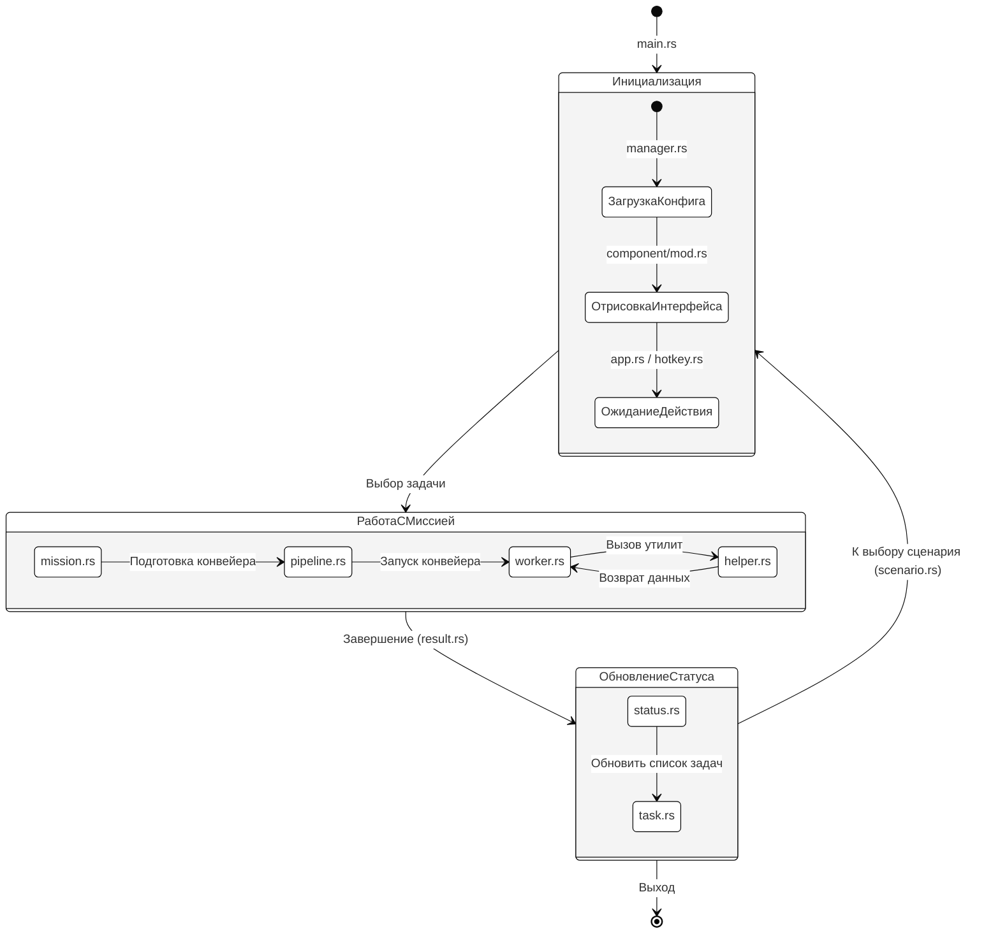

# Граф диалога

```mermaid
%%{init: {
  'theme': 'base',
  'themeVariables': {
    'primaryColor': '#fff',
    'primaryBorderColor': '#000',
    'fontSize': '16px',
    'activationBorderColor': '#000'
  }
}}%%
stateDiagram-v2
    [*] --> Инициализация: main.rs

    state Инициализация {
        direction TB
        [*] --> ЗагрузкаКонфига: manager.rs
        ЗагрузкаКонфига --> ОтрисовкаИнтерфейса: component/mod.rs
        ОтрисовкаИнтерфейса --> ОжиданиеДействия: app.rs / hotkey.rs
    }

    Инициализация --> РаботаСМиссией: Выбор задачи

    state РаботаСМиссией {
        direction LR
        mission.rs --> pipeline.rs: Подготовка конвейера
        pipeline.rs --> worker.rs: Запуск конвейера
        worker.rs --> helper.rs: Вызов утилит
        helper.rs --> worker.rs: Возврат данных
    }

    РаботаСМиссией --> ОбновлениеСтатуса: Завершение (result.rs)

    state ОбновлениеСтатуса {
        status.rs --> task.rs: Обновить список задач
    }

    ОбновлениеСтатуса --> Инициализация: К выбору сценария (scenario.rs)
    ОбновлениеСтатуса --> [*]: Выход

```
