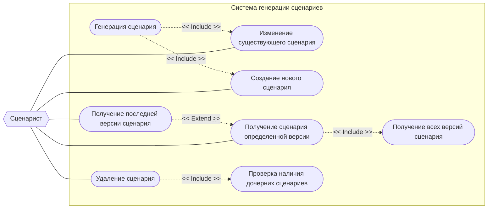

```mermaid
graph LR
    subgraph "Система генерации сценариев"
        UC1([Изменение существующего сценария])
        UC2([Создание нового сценария])
        UC3([Генерация сценария])
        UC4([Получение сценария определенной версии])
        UC5([Получение всех версий сценария])
        UC6([Получение последней версии сценария])
        UC7([Удаление сценария])
        UC8([Проверка наличия дочерних сценариев])

        %% Связи отношений
        UC3 -. "<< Include >>" .-> UC1
        UC3 -. "<< Include >>" .-> UC2
        UC4 -. "<< Include >>" .-> UC5
        UC6 -. "<< Extend >>" .-> UC4
        UC7 -. "<< Include >>" .-> UC8
    end

    Actor{{Сценарист}}
    
    %% Связи актера
    Actor --- UC1
    Actor --- UC2
    Actor --- UC4
    Actor --- UC6
    Actor --- UC7
```
