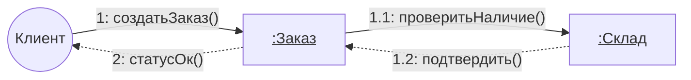

```mermaid
graph LR
    %% Определение участников (объектов)
    User((Клиент))
    Order[<u>:Заказ</u>]
    Stock[<u>:Склад</u>]

    %% Сообщения с нумерацией
    User -- "1: создатьЗаказ()" --> Order
    Order -- "1.1: проверитьНаличие()" --> Stock
    Stock -. "1.2: подтвердить()" .-> Order
    Order -. "2: статусОк()" .-> User

```
