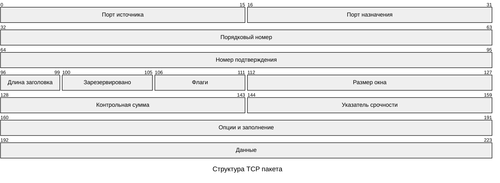

```mermaid
packet-beta
    title Структура TCP пакета
    0-15: "Порт источника"
    16-31: "Порт назначения"
    32-63: "Порядковый номер"
    64-95: "Номер подтверждения"
    96-99: "Длина заголовка"
    100-105: "Зарезервировано"
    106-111: "Флаги"
    112-127: "Размер окна"
    128-143: "Контрольная сумма"
    144-159: "Указатель срочности"
    160-191: "Опции и заполнение"
    192-223: "Данные"
```
