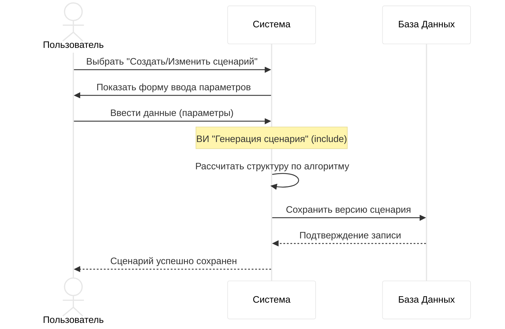
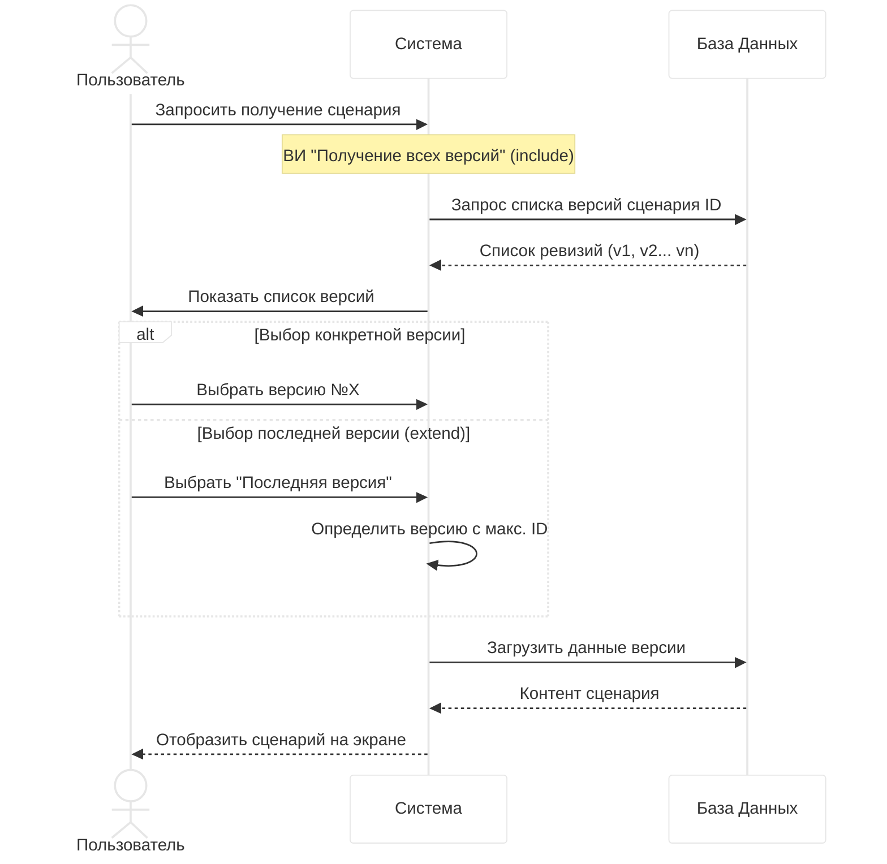
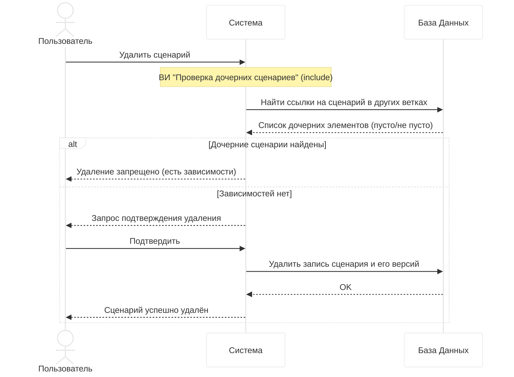

"Создание нового сценария/Изменение существующего сценария"

```mermaid
%%{init: {'theme': 'base', 'themeVariables': { 'primaryColor': '#fff', 'edgeColor': '#000', 'lineColor': '#000', 'actorTextColor': '#000'}}}%%
sequenceDiagram
    actor User as Пользователь
    participant System as Система
    participant DB as База Данных

    User->>System: Выбрать "Создать/Изменить сценарий"
    System->>User: Показать форму ввода параметров
    User->>System: Ввести данные (параметры)
    
    Note over System: ВИ "Генерация сценария" (include)
    System->>System: Рассчитать структуру по алгоритму
    
    System->>DB: Сохранить версию сценария
    DB-->>System: Подтверждение записи
    System-->>User: Сценарий успешно сохранен

```

"Получение сценария определённой версии"

```mermaid
%%{init: {'theme': 'base', 'themeVariables': { 'primaryColor': '#fff', 'edgeColor': '#000', 'lineColor': '#000'}}}%%
sequenceDiagram
    actor User as Пользователь
    participant System as Система
    participant DB as База Данных

    User->>System: Запросить получение сценария
    
    Note over System: ВИ "Получение всех версий" (include)
    System->>DB: Запрос списка версий сценария ID
    DB-->>System: Список ревизий (v1, v2... vn)
    
    System->>User: Показать список версий
    
    alt Выбор конкретной версии
        User->>System: Выбрать версию №X
    else Выбор последней версии (extend)
        User->>System: Выбрать "Последняя версия"
        System->>System: Определить версию с макс. ID
    end

    System->>DB: Загрузить данные версии
    DB-->>System: Контент сценария
    System-->>User: Отобразить сценарий на экране
```

---

"Удаление сценария"

```mermaid
%%{init: {'theme': 'base', 'themeVariables': { 'primaryColor': '#fff', 'edgeColor': '#000', 'lineColor': '#000'}}}%%
sequenceDiagram
    actor User as Пользователь
    participant System as Система
    participant DB as База Данных

    User->>System: Удалить сценарий
    
    Note over System: ВИ "Проверка дочерних сценариев" (include)
    System->>DB: Найти ссылки на сценарий в других ветках
    DB-->>System: Список дочерних элементов (пусто/не пусто)
    
    alt Дочерние сценарии найдены
        System-->>User: Удаление запрещено (есть зависимости)
    else Зависимостей нет
        System-->>User: Запрос подтверждения удаления
        User->>System: Подтвердить
        System->>DB: Удалить запись сценария и его версий
        DB-->>System: OK
        System-->>User: Сценарий успешно удалён
    end
```
