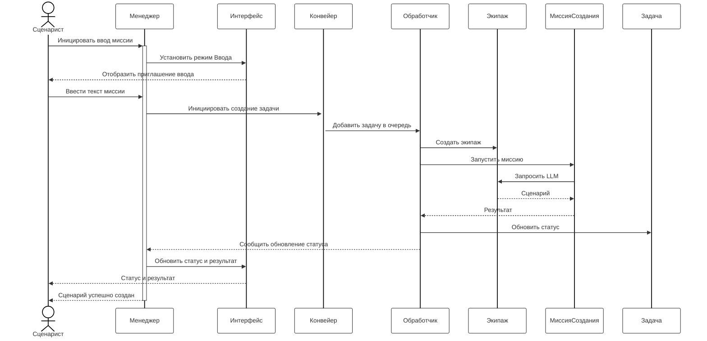
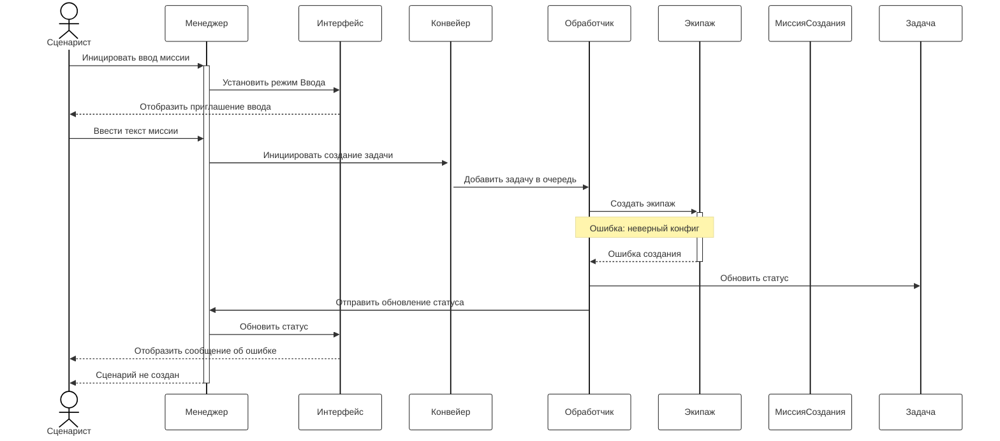
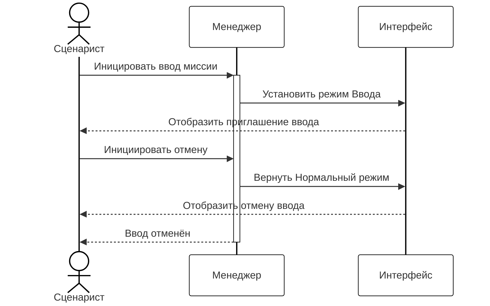

# Диаграмма последовательностей взаимодействия объектов классов пакета

## Нормальный ход событий

```mermaid
%%{init: {
  'theme': 'base',
  'themeVariables': {
    'primaryColor': '#fff',
    'primaryBorderColor': '#000',
    'fontSize': '16px',
    'activationBorderColor': '#000'
  }
}}%%
sequenceDiagram
    actor Сценарист as Сценарист
    participant Менеджер as Менеджер
    participant Интерфейс as Интерфейс
    participant Конвейер as Конвейер
    participant Обработчик as Обработчик
    participant Экипаж as Экипаж
    participant МиссияСоздания as МиссияСоздания
    participant Задача as Задача

    Сценарист->>+Менеджер: Иницировать ввод миссии
    Менеджер->>Интерфейс: Установить режим Ввода
    Интерфейс-->>Сценарист: Отобразить приглашение ввода
    Сценарист->>Менеджер: Ввести текст миссии
    Менеджер->>+Конвейер: Инициировать создание задачи
    Конвейер->>Обработчик: Добавить задачу в очередь
    Обработчик->>Экипаж: Создать экипаж
    Обработчик->>МиссияСоздания: Запустить миссию
    МиссияСоздания->>Экипаж: Запросить LLM
    Экипаж-->>МиссияСоздания: Сценарий
    МиссияСоздания-->>Обработчик: Результат
    Обработчик->>Задача: Обновить статус
    Обработчик-->>Менеджер: Сообщить обновление статуса
    Менеджер->>Интерфейс: Обновить статус и результат
    Интерфейс-->>Сценарист: Статус и результат
    Менеджер-->>-Сценарист: Сценарий успешно создан
```

## Прерывание процесса системой

```mermaid
%%{init: {
  'theme': 'base',
  'themeVariables': {
    'primaryColor': '#fff',
    'primaryBorderColor': '#000',
    'fontSize': '16px',
    'activationBorderColor': '#000'
  }
}}%%
sequenceDiagram
    actor Сценарист as Сценарист
    participant Менеджер as Менеджер
    participant Интерфейс as Интерфейс
    participant Конвейер as Конвейер
    participant Обработчик as Обработчик
    participant Экипаж as Экипаж
    participant МиссияСоздания as МиссияСоздания
    participant Задача as Задача

    Сценарист->>+Менеджер: Иницировать ввод миссии
    Менеджер->>Интерфейс: Установить режим Ввода
    Интерфейс-->>Сценарист: Отобразить приглашение ввода
    Сценарист->>Менеджер: Ввести текст миссии
    Менеджер->>+Конвейер: Инициировать создание задачи
    Конвейер->>Обработчик: Добавить задачу в очередь
    Обработчик->>+Экипаж: Создать экипаж
    Note over Обработчик,Экипаж: Ошибка: неверный конфиг
    Экипаж-->>-Обработчик: Ошибка создания
    Обработчик->>Задача: Обновить статус
    Обработчик->>Менеджер: Отправить обновление статуса
    Менеджер->>Интерфейс: Обновить статус
    Интерфейс-->>Сценарист: Отобразить сообщение об ошибке
    Менеджер-->>-Сценарист: Сценарий не создан
```

## Прерывание процесса пользователем

```mermaid
%%{init: {
  'theme': 'base',
  'themeVariables': {
    'primaryColor': '#fff',
    'primaryBorderColor': '#000',
    'fontSize': '16px',
    'activationBorderColor': '#000'
  }
}}%%
sequenceDiagram
    actor Сценарист as Сценарист
    participant Менеджер as Менеджер
    participant Интерфейс as Интерфейс
	
    Сценарист->>+Менеджер: Иницировать ввод миссии
    Менеджер->>Интерфейс: Установить режим Ввода
    Интерфейс-->>Сценарист: Отобразить приглашение ввода
    Сценарист->>Менеджер: Инициировать отмену
    Менеджер->>Интерфейс: Вернуть Нормальный режим
    Интерфейс-->>Сценарист: Отобразить отмену ввода
    Менеджер-->>-Сценарист: Ввод отменён
```
