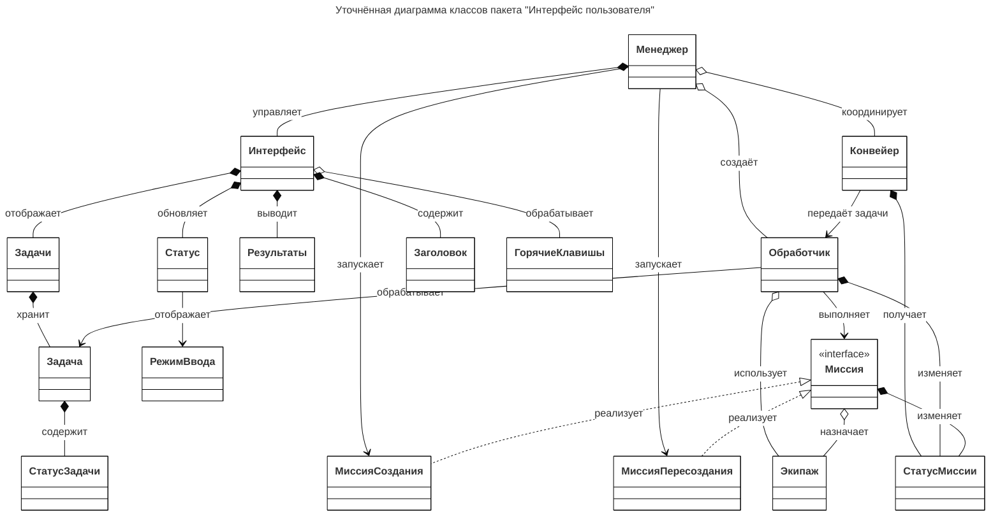

# 3. Уточнённая диаграмма классов

```mermaid
---
title: Уточнённая диаграмма классов пакета "Интерфейс пользователя"
---
%%{init: {
  'theme': 'base',
  'themeVariables': {
    'primaryColor': '#fff',
    'primaryBorderColor': '#000',
    'fontSize': '16px',
    'activationBorderColor': '#000'
  }
}}%%
classDiagram
    Менеджер *-- Интерфейс : управляет
    Менеджер o-- Конвейер : координирует
    Менеджер --> МиссияСоздания : запускает
    Менеджер o-- Обработчик : создаёт
    Менеджер --> МиссияПересоздания : запускает
    
    Интерфейс *-- Задачи : отображает
    Интерфейс *-- Результаты : выводит
    Интерфейс *-- Статус : обновляет
    Интерфейс *-- Заголовок : содержит
    Интерфейс o-- ГорячиеКлавишы : обрабатывает
    
    Задачи *-- Задача : хранит
    Задача *-- СтатусЗадачи : содержит
    Статус --> РежимВвода : отображает
    
    Конвейер --> Обработчик : передаёт задачи
    Конвейер *-- СтатусМиссии : получает
    
    Обработчик --> Миссия : выполняет
    Обработчик --> Задача : обрабатывает
    Обработчик o-- Экипаж : использует
    Обработчик *-- СтатусМиссии : изменяет
    
    <<interface>> Миссия
    Миссия <|.. МиссияСоздания : реализует
    Миссия <|.. МиссияПересоздания : реализует
    Миссия o-- Экипаж : назначает
    Миссия *-- СтатусМиссии : изменяет
```
