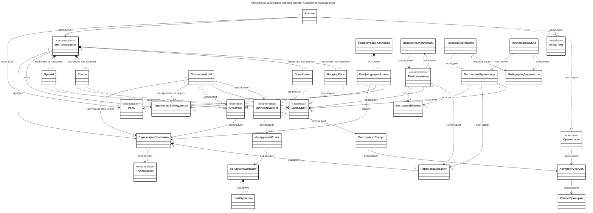

# 3. Уточнённая диаграмма классов

```mermaid
---
title: Уточнённая диаграмма классов пакета "Обработка эмбеддингов"
---
%%{init: {
  'theme': 'base',
  'themeVariables': {
    'primaryColor': '#fff',
    'primaryBorderColor': '#000',
    'fontSize': '16px',
    'activationBorderColor': '#000'
  }
}}%%
classDiagram

    Экипаж "1" --> "1..*" Роль : назначает
    Экипаж "1" --> "1..*" ТипПоставщика : использует
    Экипаж ..|> Ассистент : реализует
    Экипаж ..|> Сравнитель : реализует

    КонфигурацияЭкипажа "1" *-- "1..*" КонфигурацияАгента : включает

    КонфигурацияАгента "1" --> "1" ПараметрыОтветчика : задает
    КонфигурацияАгента "1" --> "0..1" ПараметрыЭмбеддингов : задает
    КонфигурацияАгента "1" --> "1" Роль : определяет

    class Роль {
        <<enumeration>>
    }

    class Ассистент {
        <<interface>>
    }

    class Сравнитель {
        <<interface>>
    }

    Сравнитель "1" --> "1" АргументСтатуса : принимает

    class ТипПоставщика {
        <<enumeration>>
    }

    ТипПоставщика "1" --> "1" ПараметрыОтветчика : требует
    ТипПоставщика "1" --> "0..1" ПараметрыЭмбеддингов : требует

    ТипПоставщика "1" *-- "0..1" OpenAI : включает как вариант
    ТипПоставщика "1" *-- "0..1" Ollama : включает как вариант
    ТипПоставщика "1" *-- "0..1" OpenRouter : включает как вариант
    ТипПоставщика "1" *-- "0..1" HuggingFace : включает как вариант

    OpenAI ..|> Эмбеддинг : реализует
    Ollama ..|> Эмбеддинг : реализует
    OpenRouter ..|> Эмбеддинг : реализует
    HuggingFace ..|> Эмбеддинг : реализует

    OpenAI ..|> Ответчик : реализует
    Ollama ..|> Ответчик : реализует
    OpenRouter ..|> Ответчик : реализует
    HuggingFace ..|> Ответчик : реализует

    class Ответчик {
        <<interface>>
    }

    Ответчик "1" --> "1" ПараметрыОтветчика : использует

    ПоставщикLLM "1" --> "1" ПараметрыОтветчика : настраивается через
    ПоставщикLLM "1" --> "0..1" ПараметрыЭмбеддингов : настраивается через
    ПоставщикLLM "1" --> "1..*" Ответчик : управляет
    ПоставщикLLM "1" --> "0..*" Эмбеддинг : создает
    ПоставщикLLM "1" --> "0..*" ТипИнструмента : подключает

    class Поставщики {
        <<enumeration>>
    }

    ПараметрыОтветчика "1" --> "1" Поставщики : определяет
    ПараметрыОтветчика "1" *-- "1" ПараметрыМодели : содержит

    ПараметрыКоллекции "1" --> "1" ТипХранилища : определяет

    class ТипХранилища {
        <<enumeration>>
    }

    class Эмбеддинг {
        <<interface>>
    }

    class ТипИнструмента {
        <<enumeration>>
    }

    ТипИнструмента "1" --> "0..1" ИнструментОтвет : активирует
    ТипИнструмента "1" --> "0..1" ИнструментСтатус : активирует

    ПоставщикХранилища "1" --> "1" ВекторныйИндекс : использует
    ПоставщикХранилища "1" --> "1" ПараметрыМодели : считывает
    ПоставщикХранилища "1" --> "0..*" Эмбеддинг : сохраняет

    ПоставщикВПамяти --|> ПоставщикХранилища : наследует
    ПоставщикВПамяти "1" --> "0..*" ЭмбеддингДокументов : обрабатывает

    ПоставщикSQLite --|> ПоставщикХранилища : наследует
    ПоставщикSQLite "1" --> "0..*" ЭмбеддингДокументов : сохраняет

    ТипХранилища "1" --> "1" ВекторныйИндекс : создает
    ТипХранилища "1" --> "0..*" Эмбеддинг : связывает
    ТипХранилища "1" --> "1" ПараметрыКоллекции : применяет
    ТипХранилища "1" --> "1" ПараметрыМодели : использует

    ИнструментОтвет "1" --> "1" АргументСценария : принимает
    АргументСценария "1" *-- "1..*" ШагСценария : содержит

    ИнструментСтатус "1" --> "1" АргументСтатуса : принимает
    АргументСтатуса "1" --> "1" СтатусПроверки : возвращает
```
