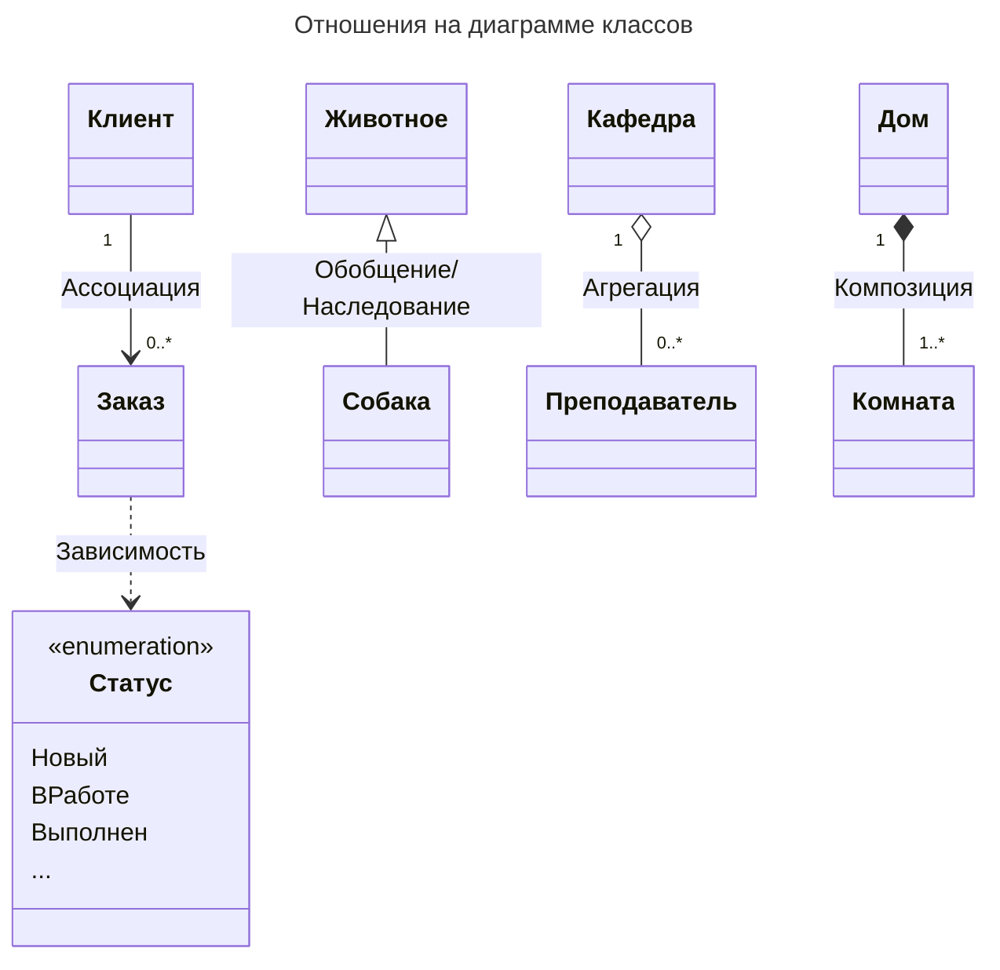
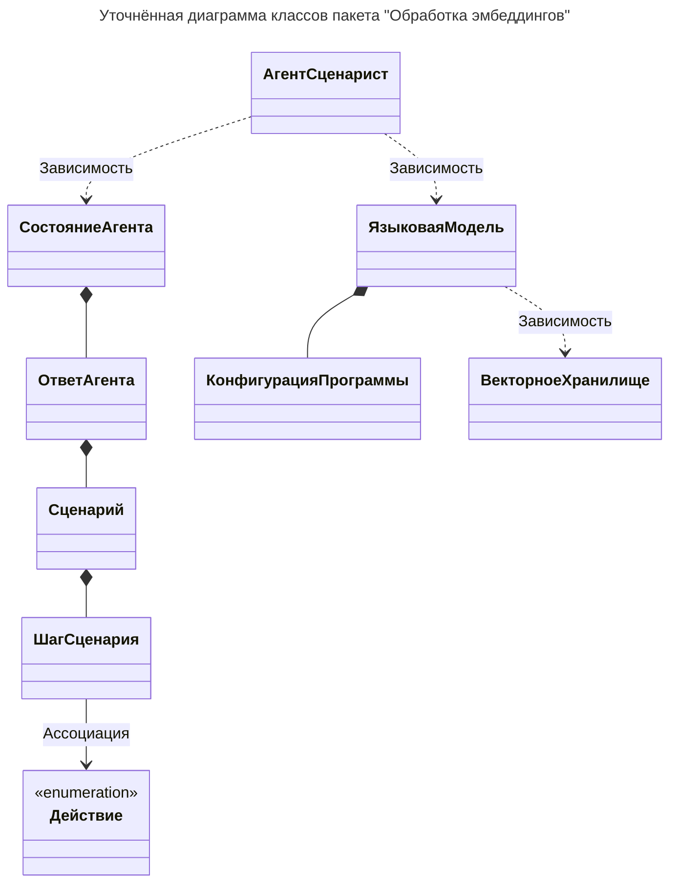

# Уточнённая диаграмма классов

> **Задача**: Привести диаграмму в соответствие с логикой работы агента-Сценариста и ядра программы.
> Возьми `diagrammy/Пакет Обработка эмбеддингов/1. Исходная диаграмма классов.md`, скопируй и поменяй тип стрелки в отношениях между классами на конкретный тип отношения.
> Тип отношения определяется по исходному коду, а не выбирается произвольно (Ассоциация, Зависимость, Обобщение, Агрегация, Композиция или Реализация).
> Название связей оставь прежними, кроме типа Композиция: название нужно удалить.
> Мощность отношения не нужна.

```mermaid
---
title: Отношения на диаграмме классов
---
classDiagram
    %% Отношение ассоциации
    class Клиент
    class Заказ
    Клиент "1" --> "0..*" Заказ: Ассоциация

    %% Отношение зависимости
    class Статус{
	    <<enumeration>>
        Новый
        ВРаботе
        Выполнен
        ...
    }
    Заказ ..> Статус: Зависимость

    %% Отношение обобщения (наследования)
    class Животное
    class Собака
    Животное <|-- Собака: Обобщение/Наследование

    %% Отношение агрегации
    class Кафедра
    class Преподаватель
    Кафедра "1" o-- "0..*" Преподаватель: Агрегация

    %% Отношение композиции
    class Дом
    class Комната
    Дом "1" *-- "1..*" Комната: Композиция
```

```mermaid
---
title: Уточнённая диаграмма классов пакета "Обработка эмбеддингов"
---
classDiagram
    АгентСценарист ..> ЯзыковаяМодель : Зависимость
    АгентСценарист ..> СостояниеАгента : Зависимость
    СостояниеАгента *-- ОтветАгента
    ОтветАгента *-- Сценарий
    Сценарий *-- ШагСценария
    ШагСценария --> Действие : Ассоциация
    ЯзыковаяМодель *-- КонфигурацияПрограммы
    ЯзыковаяМодель ..> ВекторноеХранилище : Зависимость

    class Действие {
        <<enumeration>>
    }
```

Связи уточняют отношения между исходными классами #TODO 
