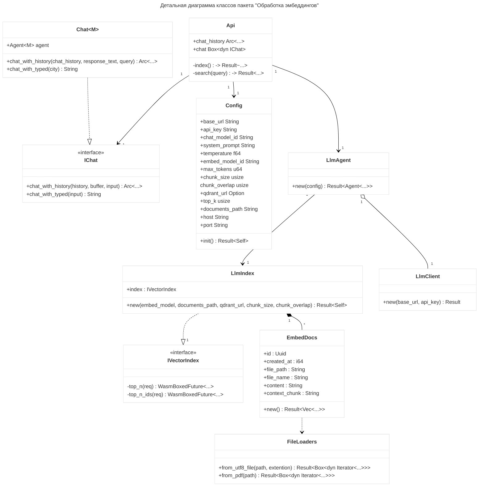

```mermaid
---
title: Детальная диаграмма классов пакета "Обработка эмбеддингов"
---
%%{init: {'theme': 'base', 'themeVariables': { 'primaryColor': '#fff', 'edgeColor': '#000', 'lineColor': '#000', 'actorTextColor': '#000'}}}%%
classDiagram    
    %% Interface
    class Config {
        +base_url String
		+api_key String
		+chat_model_id String
		+system_prompt String
		+temperature f64
		+embed_model_id String
		+max_tokens u64
		+chunk_size usize
		chunk_overlap usize
		+qdrant_url Option<String>
		+top_k usize
		+documents_path String
		+host String
		+port String
        +init() Result~Self~
    }
    
    class IChat {
        <<interface>>
        +chat_with_history(history, buffer, input) Arc~...~
        +chat_with_typed(input) String
    }
    
    %% Implementations
    class LlmIndex {
        +index : IVectorIndex
        +new(embed_model, documents_path, qdrant_url, chunk_size, chunk_overlap) Result~Self~
    }

    class EmbedDocs {
        +id : Uuid
        +created_at : i64
        +file_path : String
        +file_name : String
        +content : String
        +context_chunk : String
        +new() Result~Vec~...~~
    }
    
    class FileLoaders {
	    +from_utf8_file(path, extention) Result~Box~dyn Iterator~...~~~
	    +from_pdf(path) Result~Box~dyn Iterator~...~~~
    }
    
    class Chat~M~ {
        +Agent~M~ agent
        +chat_with_history(chat_history, response_text, query) Arc~...~
        +chat_with_typed(city) String
    }
    
    class IVectorIndex{
	    <<interface>>
	    -top_n(req) WasmBoxedFuture~...~
	    -top_n_ids(req) WasmBoxedFuture~...~
    }

    class Api {
		+chat_history Arc~...~
		+chat Box~dyn IChat~
		-index() -> Result~...>
	    -search(query) -> Result~...~
    }
    
    class LlmAgent {
	    +new(config) Result~Agent~...~~
    }
    
    class LlmClient {
	    +new(base_url, api_key) Result<Self>
    }

    %% Relations
    Chat~M~ ..|> IChat
    
    LlmIndex "1" ..|> "1" IVectorIndex
    LlmIndex "1" *-- "*" EmbedDocs
    
    LlmAgent "1" --> "1" LlmIndex
    LlmAgent "1" o-- "1" LlmClient
    
    Api "1" --> "1" IChat
    Api "1" --> "1" Config
    Api "1" --> "1" LlmAgent

    EmbedDocs ..> FileLoaders
```
