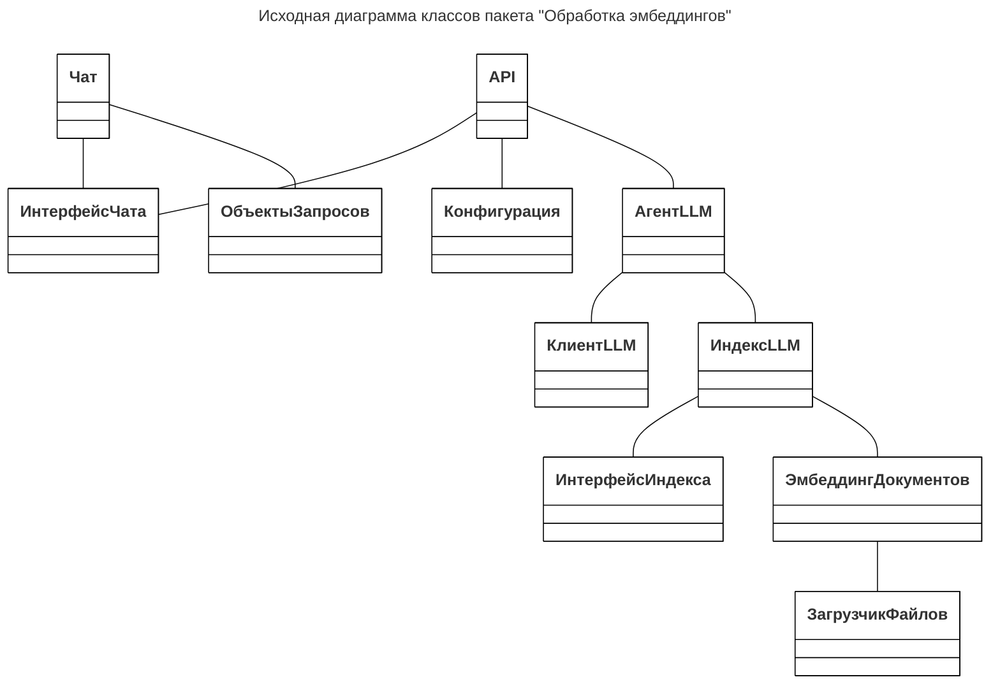

```mermaid
---
title: Исходная диаграмма классов пакета "Обработка эмбеддингов"
---
%%{init: {
  'theme': 'base',
  'themeVariables': {
    'primaryColor': '#fff',
    'primaryBorderColor': '#000',
    'fontFamily': 'arial',
    'fontSize': '16px',
    'signalTextColor': '#000'
  }
}}%%
classDiagram
    class АгентLLM
    class КлиентLLM
    class ИндексLLM
    class ИнтерфейсИндекса
    class ЭмбеддингДокументов
    class ЗагрузчикФайлов
    class Чат
    class ИнтерфейсЧата
    class ОбъектыЗапросов
    class API
    class Конфигурация

    АгентLLM -- КлиентLLM
    АгентLLM -- ИндексLLM
    ИндексLLM -- ИнтерфейсИндекса
    ИндексLLM -- ЭмбеддингДокументов
    ЭмбеддингДокументов -- ЗагрузчикФайлов
    Чат -- ИнтерфейсЧата
    Чат -- ОбъектыЗапросов
    API -- ИнтерфейсЧата
    API -- Конфигурация
    API -- АгентLLM
```
