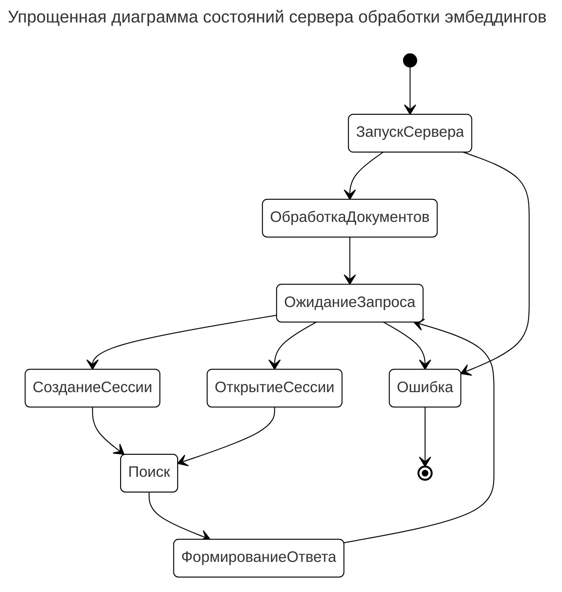

```mermaid
---
title: Упрощенная диаграмма состояний сервера обработки эмбеддингов
---
%%{init: {
  'theme': 'base',
  'themeVariables': {
    'primaryColor': '#fff',
    'primaryBorderColor': '#000',
    'lineColor': '#000',
    'tertiaryColor': '#fff',
    'edgeColor': '#000',
    'fontFamily': 'arial',
    'fontSize': '16px'
  }
}}%%
stateDiagram-v2
    [*] --> ЗапускСервера
    ЗапускСервера --> ОбработкаДокументов
    ОбработкаДокументов --> ОжиданиеЗапроса
    ЗапускСервера --> Ошибка
    
    ОжиданиеЗапроса --> СозданиеСессии
    ОжиданиеЗапроса --> ОткрытиеСессии
    
    СозданиеСессии --> Поиск
    ОткрытиеСессии --> Поиск
    
    Поиск --> ФормированиеОтвета
    ФормированиеОтвета --> ОжиданиеЗапроса
    
    ОжиданиеЗапроса --> Ошибка
    Ошибка --> [*]
```
