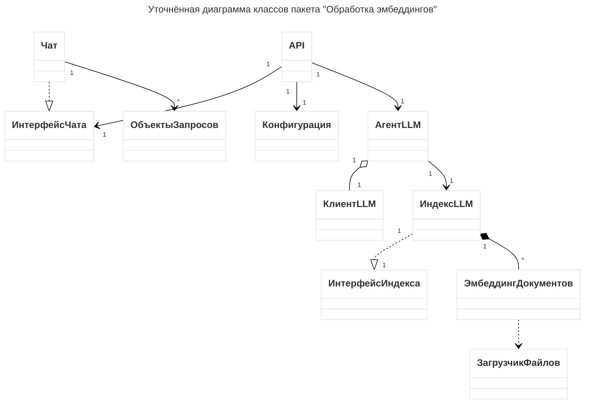

```mermaid
---
title: Уточнённая диаграмма классов пакета "Обработка эмбеддингов"
---
%%{init: {'theme': 'base', 'themeVariables': { 'primaryColor': '#fff', 'edgeColor': '#000', 'lineColor': '#000', 'actorTextColor': '#000'}}}%%
classDiagram
    class АгентLLM
    class КлиентLLM
    class ИндексLLM
    class ИнтерфейсИндекса
    class ЭмбеддингДокументов
    class ЗагрузчикФайлов
    class Чат
    class ИнтерфейсЧата
    class ОбъектыЗапросов
    class API
    class Конфигурация

    АгентLLM "1" o-- "1" КлиентLLM
    АгентLLM "1" --> "1" ИндексLLM

    ИндексLLM "1" ..|> "1" ИнтерфейсИндекса
    ИндексLLM "1" *-- "*" ЭмбеддингДокументов
    
    ЭмбеддингДокументов ..> ЗагрузчикФайлов
    
    Чат ..|> ИнтерфейсЧата
    Чат "1" --> "*" ОбъектыЗапросов
    
    API "1" --> "1" ИнтерфейсЧата
    API "1" --> "1" Конфигурация
    API "1" --> "1" АгентLLM
```
