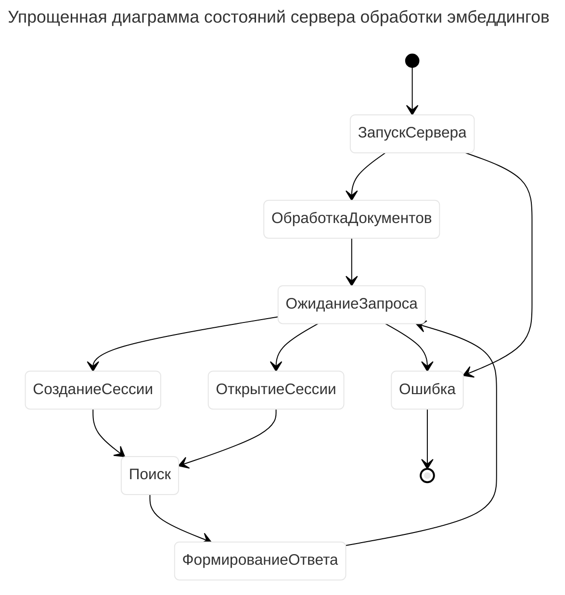

# Упрощенная диаграмма состояний сервера обработки эмбеддингов

```mermaid
---
title: Упрощенная диаграмма состояний сервера обработки эмбеддингов
---
%%{init: {'theme': 'base', 'themeVariables': { 'primaryColor': '#fff', 'edgeColor': '#000', 'lineColor': '#000', 'actorTextColor': '#000'}}}%%
stateDiagram-v2
    [*] --> ЗапускСервера
    ЗапускСервера --> ОбработкаДокументов
    ОбработкаДокументов --> ОжиданиеЗапроса
    ЗапускСервера --> Ошибка
    
    ОжиданиеЗапроса --> СозданиеСессии
    ОжиданиеЗапроса --> ОткрытиеСессии
    
    СозданиеСессии --> Поиск
    ОткрытиеСессии --> Поиск
    
    Поиск --> ФормированиеОтвета
    ФормированиеОтвета --> ОжиданиеЗапроса
    
    ОжиданиеЗапроса --> Ошибка
    Ошибка --> [*]
```
