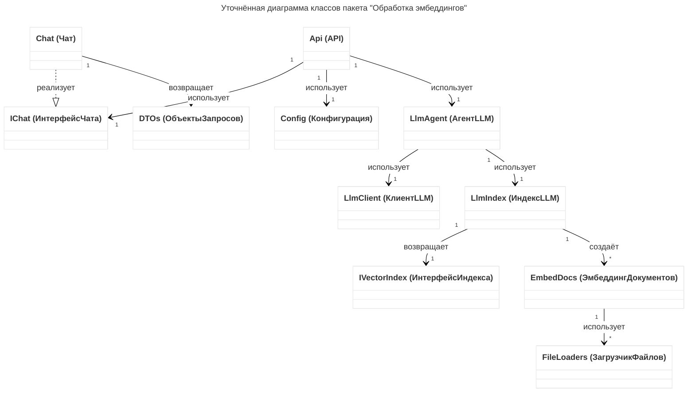
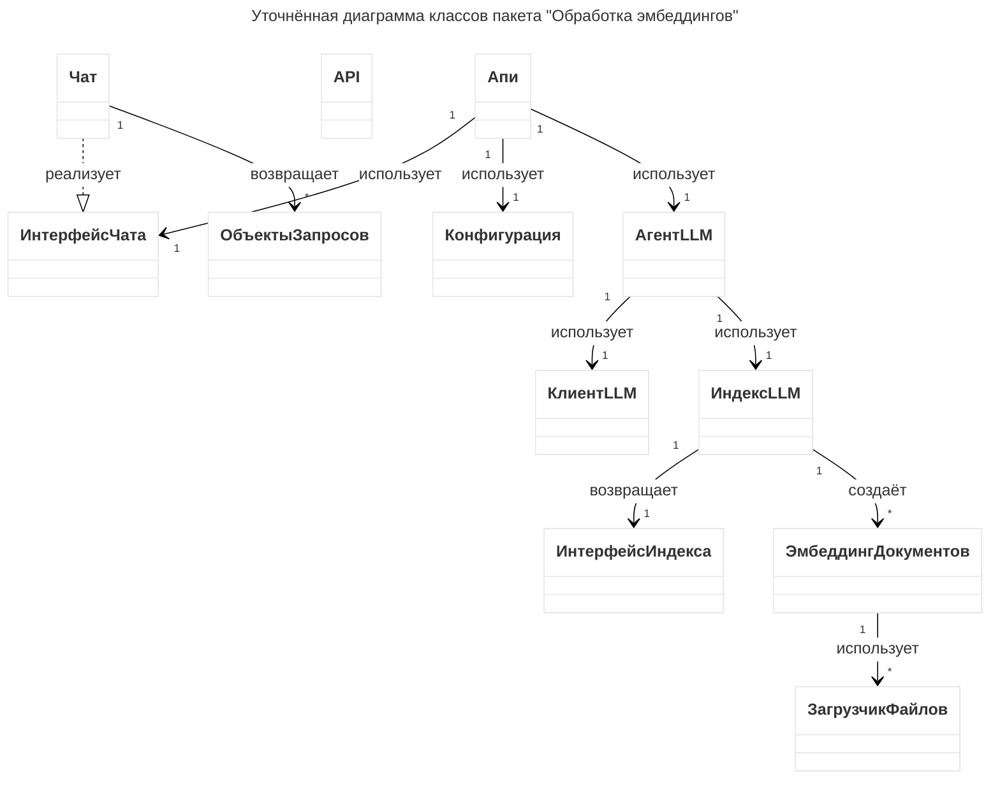

```mermaid
---
title: Уточнённая диаграмма классов пакета "Обработка эмбеддингов"
---
%%{init: {'theme': 'base', 'themeVariables': { 'primaryColor': '#fff', 'edgeColor': '#000', 'lineColor': '#000', 'actorTextColor': '#000'}}}%%
classDiagram
    class LlmAgent ["LlmAgent (АгентLLM)"]
    class LlmClient ["LlmClient (КлиентLLM)"]
    class LlmIndex ["LlmIndex (ИндексLLM)"]
    class IVectorIndex ["IVectorIndex (ИнтерфейсИндекса)"]
    class EmbedDocs ["EmbedDocs (ЭмбеддингДокументов)"]
    class FileLoaders ["FileLoaders (ЗагрузчикФайлов)"]
    class Chat ["Chat (Чат)"]
    class IChat ["IChat (ИнтерфейсЧата)"]
    class DTOs ["DTOs (ОбъектыЗапросов)"]
    class Api ["Api (API)"]
    class Config ["Config (Конфигурация)"]

    LlmAgent "1" --> "1" LlmClient : использует
    LlmAgent "1" --> "1" LlmIndex : использует

    LlmIndex "1" --> "1" IVectorIndex : возвращает
    LlmIndex "1" --> "*" EmbedDocs : создаёт
    
    EmbedDocs "1" --> "*" FileLoaders : использует
    
    Chat ..|> IChat : реализует
    Chat "1" --> "*" DTOs : возвращает
    
    Api "1" --> "1" IChat : использует
    Api "1" --> "1" Config : использует
    Api "1" --> "1" LlmAgent : использует
```

```mermaid
---
title: Уточнённая диаграмма классов пакета "Обработка эмбеддингов"
---
%%{init: {'theme': 'base', 'themeVariables': { 'primaryColor': '#fff', 'edgeColor': '#000', 'lineColor': '#000', 'actorTextColor': '#000'}}}%%
classDiagram
    class АгентLLM
    class КлиентLLM
    class ИндексLLM
    class ИнтерфейсИндекса
    class ЭмбеддингДокументов
    class ЗагрузчикФайлов
    class Чат
    class ИнтерфейсЧата
    class ОбъектыЗапросов
    class API
    class Конфигурация

    АгентLLM "1" --> "1" КлиентLLM : использует
    АгентLLM "1" --> "1" ИндексLLM : использует

    ИндексLLM "1" --> "1" ИнтерфейсИндекса : возвращает
    ИндексLLM "1" --> "*" ЭмбеддингДокументов : создаёт
    
    ЭмбеддингДокументов "1" --> "*" ЗагрузчикФайлов : использует
    
    Чат ..|> ИнтерфейсЧата : реализует
    Чат "1" --> "*" ОбъектыЗапросов : возвращает
    
    Апи "1" --> "1" ИнтерфейсЧата : использует
    Апи "1" --> "1" Конфигурация : использует
    Апи "1" --> "1" АгентLLM : использует
```
